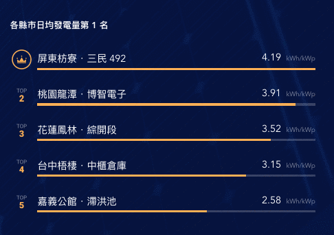

# 太陽能案場監控後台

## 畫面

## 簡介
此專案可觀看 80 個太陽能案場的即時資訊：
- 累積發電收入
- 累積發電量
- 總監控瓦數
- 各縣市日均發電量案場的冠軍
- 各案場異常狀態
- ...

## 技術

- MQTT over WebSocket 取得最新資料
- Vuex 統一管理資料狀態
- CountUp.js、Animate.css 呈現動態效果

## 測試

### 單元測試

#### 使用 `Mocha` 搭配 `Chai` & `Sinon`

#### 測試項目
- 輪播（Carousel）功能
    - Play、Pause、Previous、Next
- 載入遮罩（Loading Ovarlay）顯示/消失
- 天氣的 API
    - 可否成功取得
    - 確認資料與最新 API Response 有無同步

### E2E 測試
#### 框架
`Nightwatch`

#### 測試項目
- Dom(#app) 是否出現
- RWD 是否正常
- 點擊小地圖，是否有正確顯示顯示名稱，並截圖存證。

#### 跨瀏覽器
- chrome
- firefox
